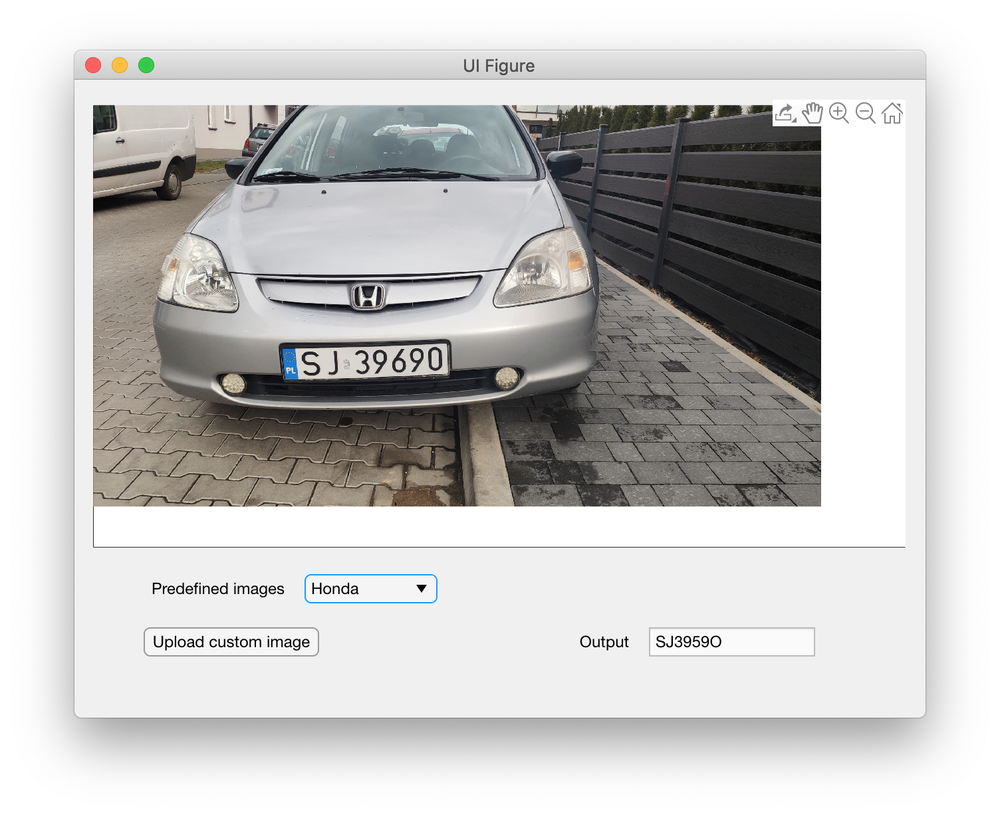
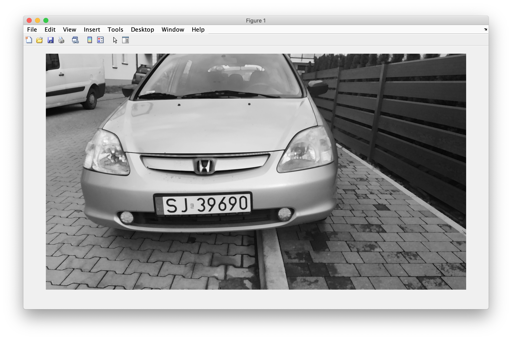
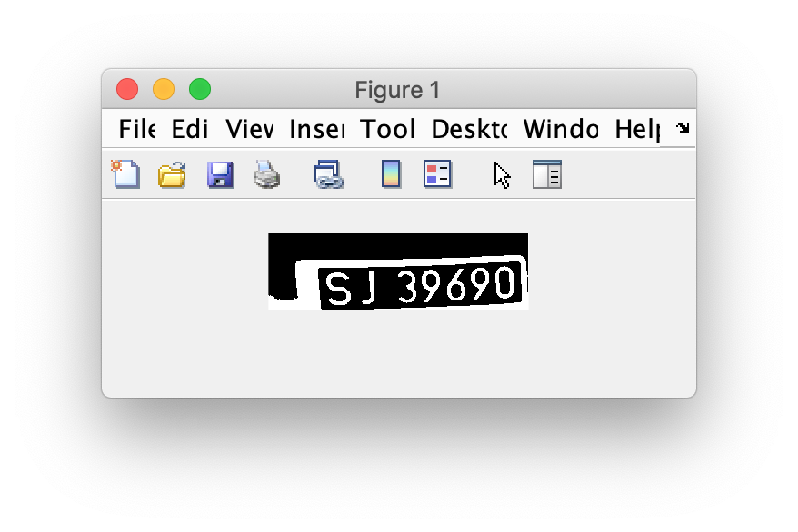
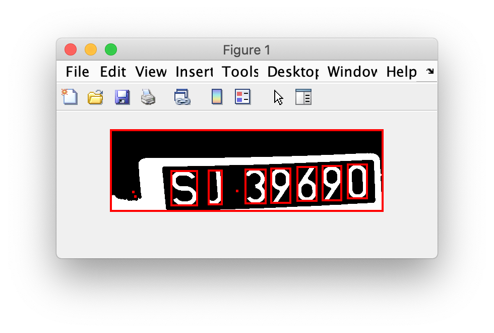

# Wykrywanie tablic rejestracyjnych #

### Dokumentacja projektu na przedmiot Analiza Obrazów ###

**Kamil Gwiżdż**  
**Piotr Kumala**  
**Patryk Chodur**

## 1. Założenia projektu ##

Założeniem projektu jest stworzenie działającego programu umożliwiającego
zczytanie numeru rejestracyjnego ze zdjęcia samochodu. Program jest
przeznaczony do tablic rejestracyjnych obecnych w Polsce oraz krajach
Unii Europejskiej. Projekt wykorzystuje template matching w celu rozpoznania
poszczególnych liter alfabetu łacińskiego oraz cyfr.

## 2. Interfejs użytkownika ##

Projekt został zrealizowany jako program z GUI napisany w środowisku matlab.
Aby uruchomić projekt należy w programie matlab przejść do głównego katalogu
projektu, uruchomić plik Projekt1.mlapp i nacisnąć przycisk Run (zielona
strzałka).

Jeśli wszystko się powiodło powinien pojawić się ekran aplikacji.

Mamy dostępnych kilka przykładowych zdjęć samochodów, wybieramy je z listy
`Predefined images`. Standardowo po uruchomieniu programu wyświetli nam się
*Honda*. Z prawej strony mamy wynik czytania tablicy `Output`, a poniżej
listy domyślnych zdjęć znajdziemy przycisk do wgrania własnego zdjęcia
`Upload custom image`, który uruchomi odpowiednie dla systemu operacyjnego
okno wczytywania pliku.

## 3. Zastosowany algorytm ##

Aplikacja korzysta z metody **template matching**, która idąc po danym
obrazie sprawdza pokrycie z każdym z szablonów. Następnie jeśli pokrycie
będzie wynosić więcej, niż ustalony próg, program stwierdzi obecność danego
znaku na zdjęciu.

Najpierw obraz jest przekształcany do skali szarości. Następnie dokonywane
jest otwarcie obrazu, aby wyeliminować część zakłóceń z obrazu.

Teraz miejsce ma wykrywanie krawędzi poziomych i pionowych, w celu
znalezienia obszaru zajmowanego przez tablicę rejestracyjną.

Na obszarze tym dokonywany jest template matching w celu zidentyfikowania
poszczególnych liter oraz cyfr na rejestracji.

Z otrzymanych liter jest tworzony numer rejestracyjny pojazdu.

## 4. Wady projektu ##

Detekcja nie działa idealnie. Dla przykładu `0` może zostać zaklasyfikowane
jako `O`. Poza tym zabrudzone, bądź przysłonięte fragmenty rejestracji mogą
nie być w pełni poprawnie wykrywane.

## 5. Potencjalne usprawnienia ##

Jednym z pomysłów jest, aby wykorzystać sieć neuronową do określania progu
użytego przy wykrywaniu liter. Ponadto aplikacja nie jest w stanie poprawnie
wykryć rejestracji z pochylonego zdjęcia. Z uwagi na sesję plany te zostały
przełożone na nieokreśloną przyszłość.

## 6. Podział obowiązków ##

**Wykrywanie krawędzi** - Kamil Gwiżdż, Piotr Kumala  
**Template matching** - Kamil Gwiżdż, Patryk Chodur  
**GUI oraz schemat projektu** - Piotr Kumala  
**Dokumentacja** - Patryk Chodur
